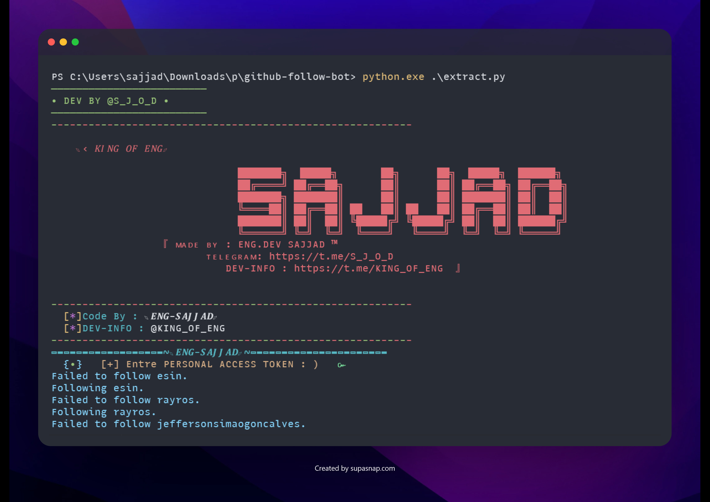
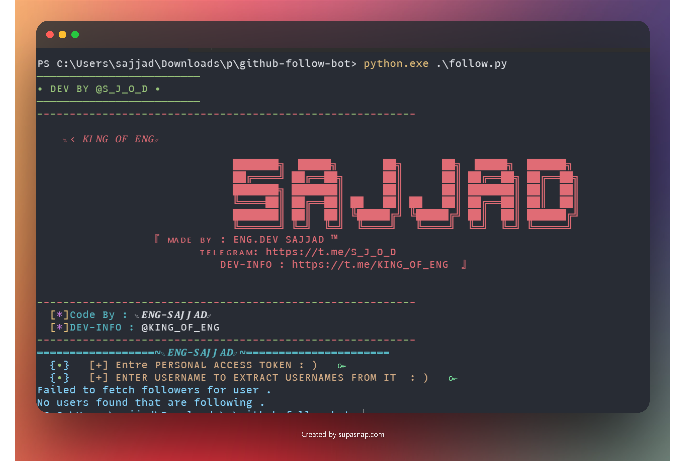
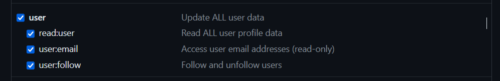

# GitHub AUTO FOLLOWING SCRIPT
Through this script you can automate github follow
<div style="display: flex; justify-content: center;">
    
</div>
<p align="center"></p>

&nbsp;<p align="center">
  [](https://open.spotify.com/user/omnitenebris)
</p>
## Features

- **Extract.py**: Extracts the usernames of GitHub users following a specific user and saves them to a file.
- **Follow.py**: Follows the users whose usernames are saved in the file generated by `extract.py`.
- **unfollow**: soon to be added in the future.
## Requirements

- Python 3
- requests

## Usage

1. **Extract.py**: Run this script first to extract the usernames of GitHub users. You will be prompted to enter your personal access token and the username of the user from whom you want to extract followers. The extracted usernames will be saved to a file named `users.txt`.

    ```bash
    python extract.py
    ```

</img>
</img>

2. **Follow.py**: After running `extract.py`, you can use this script to follow the extracted users. You will again be prompted to enter your personal access token. The script will read the list of usernames from `users.txt` and follow each user using the GitHub API.

    ```bash
    python follow.py
    ```
</img>
</img>
## Configuration

- Obtain a personal access token from GitHub with appropriate permissions.
<br>
see [DOC](https://docs.github.com/en/github/authenticating-to-github/creating-a-personal-access-token) to  create personal access token
<br>

- Ensure that you have a valid GitHub account.

## Important Note

- Keep your personal access token secure and avoid sharing it.
<br>
and do not forget give access to your personal token to follow .
like this 
<br>
</img>
## Contributors

- [ENG-SAJJAD](https://github.com/sajjad-salam)

## Contributions

Feel free to contribute, report issues, or suggest improvements by creating a pull request or opening an issue on GitHub.


